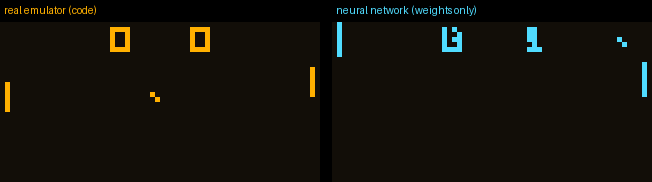

# I tried to train a neural network to *be* a game console. It hallucinated the score.

Someone got Linux running on an ESP32, and I've been thinking about it for weeks. I don't have much hardware, so I wanted a software project that's just as strange. This is where I ended up:

**What if there was no emulator at all? What if a neural network *was* the computer?**

Not a network that generates *pictures* of a game, like those Doom-diffusion demos. I wanted a network that does the CPU's actual job: take the full state of a machine (registers, memory, program counter, screen), execute one instruction, and output the next state, bit-exact. Run that in a loop and in theory you have a computer made only of weights.

This post is about a day spent trying to build that on a MacBook. Spoiler: it doesn't fully work yet. The ways it failed were more interesting than I expected, so here they all are.

---

## The target: CHIP-8

CHIP-8 is a tiny virtual machine from the 1970s: 35 instructions, 16 registers, 4KB of memory, and a 64×32 black-and-white screen. It's the "hello world" of emulator projects, which makes it about the smallest real computer I could pick.

Before any AI I needed a ground truth, so I wrote:

- a normal CHIP-8 emulator (~150 lines of Python). This is the "teacher".
- a tiny assembler
- **my own Pong** in CHIP-8 assembly (332 bytes). Both paddles are AI-controlled, so it plays itself.

**Failure #1 was mine, not the AI's.** My Pong kept rendering frames with no ball and no paddles. Printing the pixel count per frame showed it alternating 41, 28, 41, 28... and 28 was just the score digits. My game loop erased everything, ran ~40 instructions of logic, and only then redrew. Every other frame was captured mid-erase. Old CRT screens hid this with phosphor glow, so I added "phosphor" to my renderer and reordered the draw code.

## The setup

The network sees the whole machine as 88 "tokens" of up to 64 bits each: the current opcode, PC, index register, stack pointer, timers, keys, a random byte, 16 registers, 16 stack slots, 16 bytes of memory, and 32 screen rows.

It outputs the next state. A small "harness" writes that output back into the machine and fetches the next opcode. **The harness never looks at the opcode.** It has no `if opcode == JUMP` anywhere. All the knowledge of what an instruction *does* has to live in the weights.

The training data is **random machines**: random registers, random screen noise, a random stack, and one random instruction. The label is whatever my real emulator says happens next. The network never sees Pong. The plan was to train it on random chaos and then see if it can play a game it has never seen.

Everything was trained on my laptop (Apple M5, 16GB) with Apple's MLX.

---

## Failures #2–4: I couldn't even start training

**#2: I fork-bombed my laptop.** On macOS, Python's multiprocessing starts every worker by re-importing your main script. My training script had no `if __name__ == "__main__":` guard, so each data worker started its own training run, which started its own workers... The log reached 300,000 lines before I noticed.

**#3: an infinite queue.** I fed `Pool.imap` an endless generator. It happily queued work forever: 140 batches per second that nobody asked for, all unpickled on the main thread and fighting the training loop.

**#4: swap death.** Training was using 11GB (GPU memory counts on Apple Silicon) and Chrome was using 12GB, on a 16GB machine. There was 10.5GB of swap in use and steps took minutes instead of a second. Smaller batches and a hard memory cap fixed it.

## Failure #5: I rebuilt the XOR problem

First real training run: 6.4M-parameter transformer, 20 minutes. It got about 10% of instructions exactly right, and the breakdown made no sense:

| instruction | accuracy |
|---|---|
| `LD Vx, kk` (put a number in a register) | **0%** |
| `JP nnn` (jump) | **0%** |
| compare-and-skip | ~40% |
| clear screen | 80% |

The *easiest* instructions were at zero. I'd had a "clever" idea: output only *which bits flip*, so "nothing changes" is the default. But then loading a value isn't a copy any more. The network has to output `old_value XOR new_value`, and XOR is the problem that stalled neural networks in 1969. I had wrapped it around every copy instruction.

I felt clever when I spotted that. Then I fixed it and the numbers didn't move.

## Failure #6: the NOP machine

So I looked at what it actually predicted:

```
JP 8b9:    wanted PC = 8b9,  got 91c   (old PC was 91a... it just did +2)
LD V8,f0:  got a2, old value was a2   (it just left it alone)
```

It had learned to be **a CPU where every instruction is a no-op.** Go to the next instruction and touch nothing. Almost every output bit really doesn't change on any given instruction, so this gets something like 99% of bits right while being completely useless. It's a very comfortable place for gradient descent to sit.

## Failure #7: it couldn't find the instruction

I made the smallest test I could think of: train *only* on `LD I, nnn`, where the answer is literally "copy the last 12 bits of the opcode". It sat at a loss of **0.693**. That's ln(2), a coin flip.

The data was fine. The problem was attention. The token that needed the answer had to *find* the opcode token among 88 tokens, and at the start attention is spread evenly, so the signal arrives diluted 88 times over. The network was being asked to discover its own wiring.

Real CPUs don't discover their wiring. They have a **bus**. So I gave the network one: every part of it now also sees a shared vector with the instruction and the registers. The same trivial test went from **coin flip to 100% in 250 steps**.

## What actually worked (partly)

With the bus in place I dropped attention entirely and split the network into two learned parts:

- a **core** that reads the bus and writes the next registers, PC, stack and memory
- a **scanline unit**: one small network shared by all 32 screen rows. Each row sees the bus and its own pixels and decides which pixels flip. A max-pool across rows acts as the "collision" wire back to the core.

That trained about 4x faster, and instructions started clicking **one at a time**:

| instruction | step 4k | step 8k |
|---|---|---|
| `JP` | 8% | **95%** |
| `LD I` | 6% | **83%** |
| `CLS` | 30% | **100%** |
| `ADD`, `SUB`, `CALL`, `RET` | ~0% | ~0% |

Arithmetic and the stack were the last holdouts. After 20k steps (28 min) it was at **35% exact on random states**, and still climbing slowly.

The best surprise of the day: **that model had never seen Pong, but it already got 51% of Pong's real instructions exactly right.** Something general had been learned.

## Closing the loop: the CPU hallucinates

Then I fine-tuned it on a mix of random states and real Pong execution traces. After another 12k steps it reached **97.7% per instruction on Pong** (and, as a nice side effect, 36.9% on random states), and I let it drive Pong by itself next to the real emulator.



Left: the real emulator. Right: the network, running only on its own outputs.

It clearly *wants* to be Pong. There are two paddles, a ball and a score. But the paddles have drifted, and the two zeros have melted into shapes that aren't digits at all. The first 12 instructions ran perfectly. **Instruction 13** was a sprite draw, and it put **2 pixels** in the wrong place. The game's logic reads the screen back, so every mistake after that fed into the next step. (An earlier checkpoint at 91% didn't even get that far: it broke on instruction #2, setting the paddle's starting position, and turned both zeros into something like a G and a 3.)

That's the core problem with a "neural computer". 97.7% sounds great, but Pong runs about 1,800 instructions per second. You need something like 99.999% per step for a game to survive even a minute, because every error becomes the input to the next step. An LLM that hallucinates gives you a wrong sentence. A CPU that hallucinates gives you a corrupted machine forever.

(It also lost catastrophic-forgetting points: fine-tuning on Pong dropped its general random-state accuracy from 35% to 15% before it partly recovered. And **failure #9**: my laptop went to sleep on battery halfway through, so 250 training steps took 18 minutes.)

---

## What I learned

1. **The hard part wasn't what I expected.** Addition is hard. But "copy this number over there" was harder at first, because the network had to discover *where* "there" was.
2. **A loss curve can look great while the model does nothing.** The NOP machine had excellent per-bit loss. Look at actual predictions early.
3. **Architecture is a form of knowledge.** Every fix that worked (a bus, a shared scanline unit, a collision wire) is also how real hardware is built. The network still learns all the logic, but it needs the right wires.
4. **Exactness is a different game from accuracy.** 97.7% is a great score for most ML tasks. For a computer it's broken.

## What's next

- Train longer, plugged in. The last 4k steps took it from 94% to 97.7% and it hasn't plateaued.
- Put reset/boot states into the trace data so the first instructions of a game get learned.
- A "neural ECC": check each step and retry when the network is unsure. Its confidence may predict its mistakes.
- The real test: a ROM it has never seen. Right now, on my held-out "bouncing smiley" ROM, it breaks at instruction 11.

All the code (emulator, assembler, Pong, training, and a very honest dev log) is in the repo. If you have ideas for getting from 97.7% to 99.999%, I'd love to hear them.

*Built in a day on a MacBook, pair-programming with Claude Code.*
