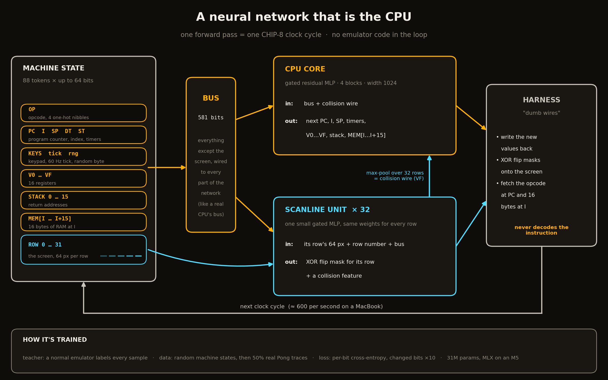

# neural-chip8

A neural network trained to *be* a CHIP-8 CPU: machine state in, next state out, no emulator logic in the loop.
Blog draft: [BLOG.md](BLOG.md). Every failure and number: [DEVLOG.md](DEVLOG.md).



| file | what |
|---|---|
| `emu.py` | reference CHIP-8 emulator (the teacher) |
| `asm.py`, `roms/*.asm` | tiny assembler + our own Pong and a held-out bounce demo |
| `encode.py` | machine state ↔ 88×64-bit tokens, and the "dumb wires" harness |
| `data.py` | random-state samples + Pong execution traces |
| `model.py` | transformer (v1) and core + scanline unit (v2) |
| `train.py` | training (MLX) |
| `probe.py` | per-instruction accuracy of a checkpoint |
| `run.py` | run a ROM on the network next to the real emulator, report divergence, write a GIF |

```sh
python3 asm.py roms/pong.asm roms/pong.ch8   # (already built)
python3 train.py --arch v2 --d 1024 --layers 4 --batch 512 --steps 20000 --lr 1e-3 --out out/run5.safetensors
python3 train.py --arch v2 --d 1024 --layers 4 --batch 512 --steps 12000 --lr 5e-4 --trace-frac 0.5 \
    --resume out/run5_final.safetensors --out out/run6.safetensors
python3 probe.py out/run6.safetensors
python3 run.py out/run6.safetensors roms/pong.ch8 --frames 300 --gif out/pong.gif
```

## Status / where we left off (2026-09-26)

Best model: run 6 (`out/run6.safetensors`, not in git; retrain with the commands above, ~30 min + ~15 min when plugged in).

- 97.7% exact per instruction on Pong traces, 36.9% on random states.
- Closed-loop Pong: first 12 instructions exact, then a `DRW` puts 2 pixels wrong and it drifts.
- Held-out bounce ROM: breaks at instruction 11.

Next things to try:
1. Keep training run 6 (`--resume out/run6.safetensors`). It was still climbing (94% → 97.7% over the last 4k steps).
2. Put boot/reset states into the trace data. Games start at random points, so the first instructions after boot are rare.
3. Weight the loss by closed-loop importance (PC/SP/stack errors are fatal, a stray pixel is less so), and upweight `DRW`.
4. "Neural ECC": use output confidence (|logit| near 0) to detect likely mistakes.
5. Share weights across the 16 registers / stack slots / memory bytes (like the scanline unit) for sample efficiency.
